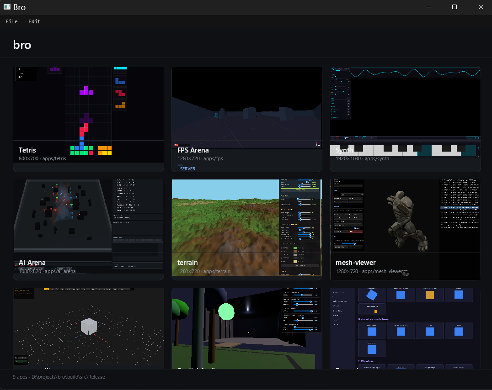

# Bro

[](https://github.com/wlejon/bro/actions/workflows/ci.yml)
[](https://github.com/wlejon/bro/actions/workflows/codeql.yml)
[](https://github.com/wlejon/bro/actions/workflows/nightly.yml)
[](https://github.com/wlejon/bro/releases/latest)
[](LICENSE)

Build desktop apps and games in **HTML/CSS/JS** with 3D, physics, audio, and on-device AI wired into javascript, in one native process. QuickJS, a custom layout engine, Skia, and OpenGL. Windows, Mac, and Linux.

** this is pre-alpha **

## What can I compare it to?

Two familiar yardsticks, plus one that doesn't have a name yet:

- **Rendering parity with Chromium** (HTML/CSS). The app layer should look right.
- **Feature parity with Godot's engine** (no editor). 3D, physics, audio, the game runtime.
- **On-device generation and perception as a native engine subsystem.** Every modality the engine renders, it can also generate and understand, locally.

## Broworkshop

[broworkshop](https://github.com/wlejon/broworkshop) houses the apps built with bro used to demonstrate the functionality.

>bro broworkshop/bro.json



The launcher and a curated set of starter apps live in the sibling [broworkshop](https://github.com/wlejon/broworkshop) repo: games, tools, demos, and AI/research apps you can clone and reshape for your own thing. bro is the runtime; the workshop is where the patterns are worked out.

## Why

Coding agents build web UIs really well. While they can build native UIs, in my experience, there's a lot more debugging happening to get something working. Electron solves that, but only for what the web platform natively supports.

In bro, HTML/CSS/JS is the UI/app layer like Electron but the rendering pipeline is ours, which means we can plug in whatever we want underneath. And we have: a 3D scene graph, Jolt physics, a real-time audio engine, mesh generation and CSG, navmesh pathfinding, game networking over GNS, native file dialogs, menu bars. All exposed to JS, all running in one process, no IPC to a Chromium renderer.

None of this is new, it's just a reconfiguration that works better for coding agents.

## Hello world

```html
<!-- hello/index.html -->
<h1 id="msg">Hello</h1>
<button id="btn">Click me</button>
<script>
  document.getElementById('btn').addEventListener('click', () => {
    document.getElementById('msg').textContent = 'Hello, bro';
  });
</script>
```

```bash
bro path/to/hello
```

See [broworkshop](https://github.com/wlejon/broworkshop) for example applications.

## What you get

**The app layer.** Write the UI the way you already do. HTML5, CSS (flexbox, grid, gradients, border radius, overflow/scroll), SVG, Canvas 2D, WebGL 2.0, Web Components with Shadow DOM, Web Workers, Fetch, localStorage, form controls with real text editing. Text is shaped by HarfBuzz with bidi reordering, so ligatures, cursive joining, and RTL come out right. three.js and jQuery just work, and your web knowledge (and your coding agent's) transfers.

**Beyond the web.** Reachable from the same JS, one process, no IPC:

| Reach for | to |
|---|---|
| `bro.scene` | 3D scene graph: meshes, sprites, particles, PBR lighting, skinned characters |
| `scene.createTerrain` · `createClipmapTerrain` · `createTileWorld` · `bro.worldgen` | chunked height-field terrain, camera-centred clipmaps, square/hex tile grids, learned elevation |
| `Physics` / physics nodes | Jolt rigid bodies, contact events, constraints, raycasts, characters, vehicles |
| `AudioContext` (broaudio) | real-time audio: synthesis, effects, spatial, MIDI |
| `bro.mesh` · `bro.ai.game` · `bro.net` | mesh generation + CSG · navmesh + A* pathfinding · game networking (GNS) |
| `<video>` · `VideoEncoder` · `GifEncoder` | WebM/VP9 playback, and encoding RGBA frames back out to a file |
| native dialogs · menu bars · gizmos · multi-window · `bro.steam` | OS-native app chrome and Steamworks integration |

**On-device AI.** Every modality above, the engine can also **generate and perceive**, locally, on the GPU, in the frame loop. No API key, no network, runs offline. `bro.gpu` probes the live CUDA/Metal/CPU backend.

| Reach for | to |
|---|---|
| `bro.lm` | generate & understand **text** (local LLMs: Qwen3, Qwen3.5, Mistral) |
| `bro.diffusion` · `bro.vision` | generate **images** (U-Net/VAE, LoRA) · perceive them (SAM, depth, normals, matting, ControlNet) |
| `bro.triposplat` · `bro.motion` | generate **3D** from a single image · generate **animation** from text |
| `bro.tts` · `bro.stt` · `bro.diar` | **speak** (Kokoro, Qwen3-TTS) · **hear** (Whisper, Parakeet, Qwen3-ASR) · **separate speakers** |
| `bro.wake` · `bro.kws` · `bro.mic` · `bro.sense` · `bro.gesture` · `bro.listen` | wake words, keyword spotting, live mic, model-free acoustic sensors, gestures, concurrent streams |
| `bro.tensor` · `bro.image` · `bro.rave` | the tensor + image-kernel substrate underneath them all, plus neural audio encode/decode |

The left-hand `bro.*` names are the whole surface. Each has an annotated JSDoc reference in [`docs/`](docs/) (read the `.js` files, not the source).

**For development.** Headless mode runs the full pipeline (GPU, real fonts, WebGL) without a window, driven by JS with virtual time for deterministic testing. See [docs/headless.md](docs/headless.md). Line-coverage reports via OpenCppCoverage are wired up for bro and every sibling, `pwsh scripts/coverage.ps1` in any repo. See [docs/coverage.md](docs/coverage.md).

## Architecture

- **QuickJS.** JavaScript engine (ES2020+).
- **bromath.** Header-only C++20 math: Vec/Quat/Mat, Color, AABB, easing curves. Used transitively by most siblings. See [bromath](https://github.com/wlejon/bromath).
- **qjsbind.** Header-only C++20 binding library for exposing C++ classes/functions to QuickJS with automatic type conversion. See [qjsbind](https://github.com/wlejon/qjsbind).
- **brokit.** Web-standard and system APIs (fetch, streams, storage, fs, crypto, events, and more). See [brokit](https://github.com/wlejon/brokit).
- **htmlayout.** HTML5 parsing (gumbo), CSS parsing, selector matching, style cascade, and block/inline/flex layout. See [htmlayout](https://github.com/wlejon/htmlayout).
- **broaudio.** Real-time audio engine. See [broaudio](https://github.com/wlejon/broaudio).
- **bromesh.** Mesh generation, manipulation, analysis, and I/O. See [bromesh](https://github.com/wlejon/bromesh).
- **broflora.** Ecosystem simulation (Makowski et al. "Synthetic Silviculture"): plants, foliage, blooms. See [broflora](https://github.com/wlejon/broflora).
- **brotensor.** Tensor type and device-neutral ops including a full training surface; CPU backend always built, CUDA/Metal additive and opt-in. Underpins brogameagent, brolm, brodiffusion, brosoundml, and brovisionml. See [brotensor](https://github.com/wlejon/brotensor).
- **brogameagent.** Game AI: navmesh, A* pathfinding, steering, perception. See [brogameagent](https://github.com/wlejon/brogameagent).
- **brolm.** Language/text-model inference: BPE + Unigram tokenizers, transformer text encoders (CLIP, T5), CLIP vision encoder + scorer, and GGUF/safetensors LLMs. The text frontend brodiffusion builds on. See [brolm](https://github.com/wlejon/brolm).
- **brodiffusion.** Diffusion-model text-to-image inference: U-Net + VAE, DDIM/LCM schedulers, LoRA, INT8. See [brodiffusion](https://github.com/wlejon/brodiffusion).
- **brosoundml.** Audio-ML model inference (TTS, STT, diarization, neural codec, wake) built on brotensor's FP32 audio op family. See [brosoundml](https://github.com/wlejon/brosoundml).
- **brovisionml.** Vision-model inference: SAM segmentation, Depth-Anything-V2 depth, DSINE surface normals, BiRefNet matting, and the ControlNet conditioning annotators (HED, lineart, MLSD, OpenPose, SegFormer). See [brovisionml](https://github.com/wlejon/brovisionml).
- **broimage.** Image decode/encode (stb) plus composable kernels (reduce/map/combine/lookup/stencil/resample/gradient), geometric ops, alpha-correct compositing, color/HSV/sRGB, normalization presets, and NHWC/NCHW preproc. Backs `bro.image` and host-side preprocessing in brolm/brodiffusion. See [broimage](https://github.com/wlejon/broimage).
- **Jolt Physics.** Rigid body physics with contact listeners, integrated into the scene graph.
- **Skia.** 2D rasterization (text, paths, images, gradients). HTML/CSS is rasterized to a texture via Skia's Ganesh GL backend, with a CPU raster fallback for `--no-gpu` headless runs. Text runs through HarfBuzz shaping and Skia's UAX#9 bidi subset, both compiled from the Skia source bundle and on in every build profile, so ligatures, cursive joining, and RTL reordering are the one text path rather than an optional upgrade.
- **SDL3.** Windowing, input events, and OpenGL contexts. All GPU work is OpenGL 3.3 Core (via glad) on SDL_GL contexts; there is no SDL_GPU, D3D12, or Metal path. The Skia-rasterized UI texture (Ganesh-GL) and the 3D scene layer are composited together as textured quads in the main GL context.

Also uses **GameNetworkingSockets** (Valve's GNS, via vcpkg), **glad** (OpenGL 3.3 Core loader), and **FastNoise2** (via brokit).

C++20, roughly 183K lines under `src/` with the JS bindings in `src/js/` making up about half of it. Three executables over one `Engine`: `bro` (windowed), `bro-headless` (headless JS scripting and testing), and `bro-server` (dedicated game server, a fixed-tickrate JS loop with net, physics, mesh and noise, no window or renderer). See [docs/multi-repo-workflow.md](docs/multi-repo-workflow.md) for development across the sibling repos.

## Building

See [BUILDING.md](BUILDING.md) for prerequisites, Skia setup, and build commands across Windows, Linux, and macOS. The build is modular: `-DBRO_PROFILE=minimal|app|full` picks a feature tier and individual `-DBRO_WITH_*` flags override it, with compiled-out features installing `{ available: false }` JS stubs. See [docs/build-options.md](docs/build-options.md).

## Usage

Double-clicking `bro` (or running it with no arguments) opens the **project manager**: a built-in home screen for creating new projects from skeletons, opening existing project folders, and drag-and-drop importing folders or .zip files. Project paths are persisted to a per-user registry (`%APPDATA%/bro/projects.json` on Windows, `~/Library/Application Support/bro/projects.json` on macOS, `~/.local/share/bro/projects.json` on Linux). See [docs/projects.md](docs/projects.md).

To run a specific app directly, pass its path:

### Windowed mode

```bash
# Windows
./build/Release/bro.exe ../broworkshop/bro.json

# Linux / macOS
./build-release/bro ../broworkshop/bro.json
```

Loads the app's `index.html`, applies stylesheets, executes scripts, and opens a window.

### Headless mode

```bash
bro-headless ../broworkshop/demos/example                                   # interactive REPL
bro-headless ../broworkshop/demos/example test.js                           # script file
bro-headless ../broworkshop/demos/example -e "document.querySelector('#btn').click()"
bro-headless --no-gpu ../broworkshop/demos/example                          # CPU-only (CI)
```

Headless globals: `screenshot(path)`, `advanceTime(ms)`, `flush()`, `sleep(ms)`, `assert(cond, msg?)`.

See [docs/headless.md](docs/headless.md) for full documentation.

## App structure

An app is a directory containing at minimum an `index.html`:

```
myapp/
  index.html      # required
  style.css       # linked via <link rel="stylesheet">
  app.js          # loaded via <script src="...">
```

For more elaborate setups, such as multiple apps under a project root with shared `lib/` and `system/` directories, see [broworkshop](https://github.com/wlejon/broworkshop) for the layout pattern (project-level `bro.json` with `default_app`, `lib`, `system`).

## JS API reference

Annotated `.js` files in [docs/](docs/). Load them in your editor for JSDoc on every binding:

**Graphics & world.** `scene-api.js`, `animation-api.js`, `lighting-api.js`, `mesh-api.js`, `terrain-api.js`, `clipmap-api.js`, `tile-api.js`, `worldgen-api.js`, `flora-api.js`, `physics-api.js`, `gizmo-api.js`, `math-api.js`, `noise-api.js`.

**Web & app surface.** `brokit-api.js`, `worker-api.js`, `iframe-api.js`, `window-api.js`, `matchmedia-api.js`, `web-animations-api.js`, `pointer-api.js`, `gamepad-api.js`, `time-api.js`, `menu-api.js`, `dialogs-api.js`, `image-api.js`, `imagebitmap-api.js`, `video-api.js`, `audio-api.js`, `net-api.js`, `net-sync-api.js`.

**On-device AI.** `gpu-api.js`, `tensor-api.js`, `lm-api.js`, `diffusion-api.js`, `vision-api.js`, `triposplat-api.js`, `motion-api.js`, `tts-api.js`, `stt-api.js`, `diar-api.js`, `rave-api.js`, `wake-api.js`, `kws-api.js`, `mic-api.js`, `sense-api.js`, `gesture-api.js`, `listen-api.js`, `ai-game-api.js`.

Plus [settings.md](docs/settings.md) (settings + action binding), [inspect.md](docs/inspect.md) (DOM inspector, very useful in headless), [system-panels.md](docs/system-panels.md) (authoring/overriding engine-level UI panels: menu bar, preferences modal, splash, inspector), [projects.md](docs/projects.md) (the project manager and skeletons), and [build-options.md](docs/build-options.md) (profiles and feature flags).

## Warning

while you technically could easily wire this up to be an actual web browser, it was not built for that. i have not paid mind to security at all. this exposes a _lot_ more of your system to javascript than a browser does. it'd be better if we didn't run random internet code in this unsecured sandbox.

## why are there so many repos?

splitting the codebase exploration into chunks makes coding agents work better for my workflow. i'll try to keep setup reasonable but i expect the submodule list will continue to grow.

## License

[MIT](LICENSE)

Third-party dependencies are under their own permissive licenses (MIT, BSD-3-Clause, zlib, Apache-2.0). See each library's LICENSE file in `third_party/` or its respective repository.
